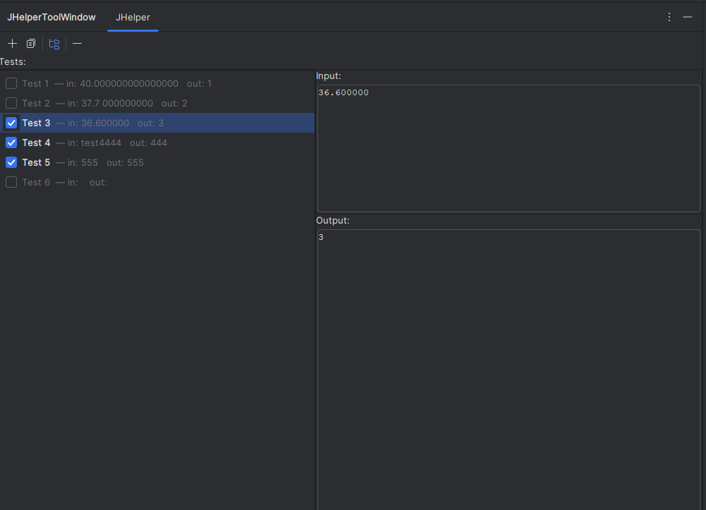

# JHelper2.0

<!-- Plugin description -->
Parse the problem using [competitive-companion] run using Clion JHelper2.0.

Features:

- [x] Ability to parse the problem using competitive-companion.
- [x] Copy sources to clipboard.
- [x] Delete a Task.
- [x] Configure tasks (i.e. update input and output)
- [x] Add a Testcase.

### Pending Features:

- [ ] Delete a testcase (Right now you can marka a test case as inactive).
- [ ] Archive a task.

<!-- Plugin description end -->

## Installation

- Go to releases and download the latest version of the plugin.
- Install it manually:
  <kbd>Settings/Preferences</kbd> > <kbd>Plugins</kbd> > <kbd>Gear Icon</kbd> > <kbd>Install plugin from Disk</kbd> >
  <kbd>Select the .zip file</kbd>

## Usage

## Special Thanks

- [AlexeyDmitriev](https://github.com/AlexeyDmitriev) for JHelper
- [EgorKulikov](https://github.com/EgorKulikov) For Idea-chelper

## Feature requests?

Just open an issue.

---
Plugin based on the [IntelliJ Platform Plugin Template][template].

[template]: https://github.com/JetBrains/intellij-platform-plugin-template

[docs:plugin-description]: https://plugins.jetbrains.com/docs/intellij/plugin-user-experience.html#plugin-description-and-presentation

[competitive-companion]: https://github.com/jmerle/competitive-companion